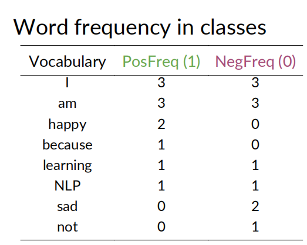
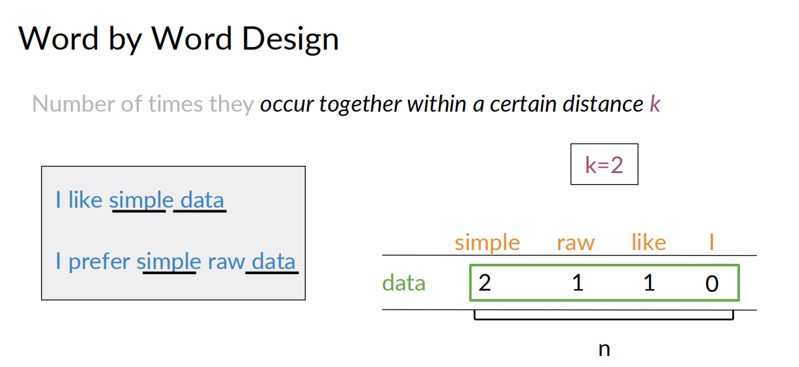
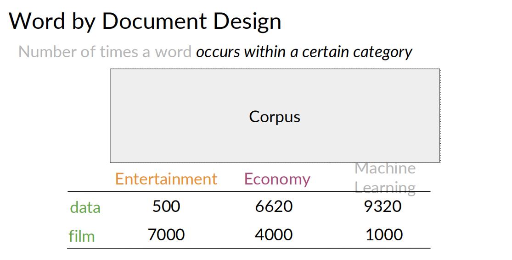
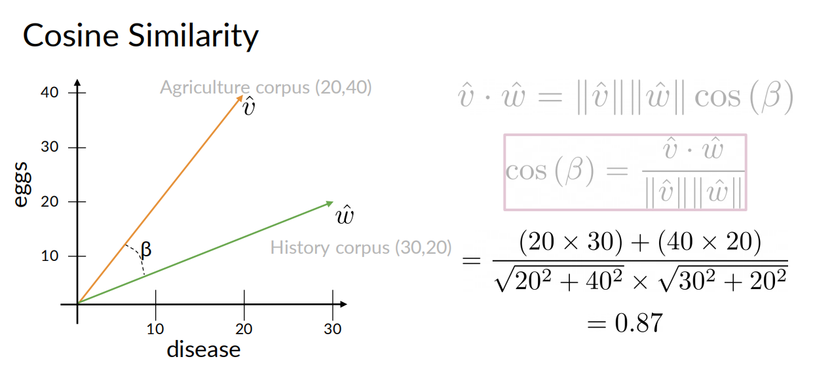
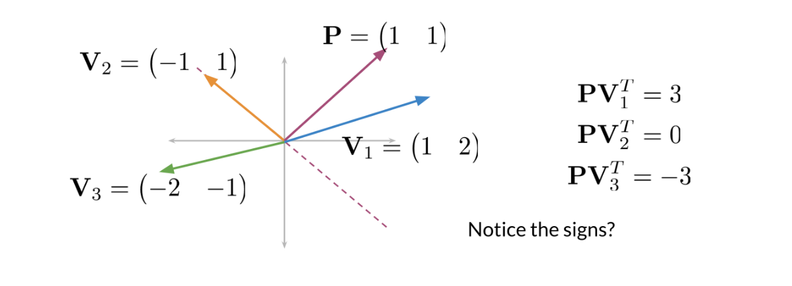

[参考视频](https://www.coursera.org/learn/classification-vector-spaces-in-nlp/)

- [Week1 分类tweets](#week1-分类tweets)
  - [预处理](#预处理)
  - [正负数据计算](#正负数据计算)
  - [特征提取](#特征提取)
  - [训练](#训练)
- [Week2 概率 + 贝叶斯规则 {#a}](#week2-概率--贝叶斯规则-a)
  - [Laplacian Smoothing](#laplacian-smoothing)
  - [log likelyhood](#log-likelyhood)
  - [朴素贝叶斯的训练](#朴素贝叶斯的训练)
  - [应用场景](#应用场景)
- [Week3 词向量](#week3-词向量)
  - [欧式距离](#欧式距离)
  - [余弦相似度](#余弦相似度)
  - [PCA](#pca)
- [Week4 机器翻译](#week4-机器翻译)
  - [Transforming](#transforming)
  - [KNN](#knn)
  - [Locality sensitive hashing （位置敏感哈希）](#locality-sensitive-hashing-位置敏感哈希)
    - [一个平面](#一个平面)
    - [多个平面](#多个平面)
  - [近似KNN](#近似knn)

## Week1 分类tweets

个人感觉这个方法比较粗糙，准确率不高

### 预处理

- Removing stopwords, punctuation, handles and URLs
- Stemming
- Lowercasing

### 正负数据计算

把收集来的tweets语料分成两类，positive和negative

为每个单词在postive和nagative中的的次数计数， 如：

### 特征提取
对于一个tweet，提取3个features
$$ [Bias, Sum Pos. Freq, Sum Neg. Freq] $$
$Bias=1$  
$Sum Pos. Freq = \sum_{\omega } freqs(w, 1)$  
$Sum Neg. Freq = \sum_{\omega } freqs(w, 0)$

如，freqs[("today",1.0)] 表示today在pos的tweets中出现的次数
freqs[("today",0.0)] 表示today在neg的tweets中出现的次数

每个单词在正负样本中出现的计数的总和

每个tweet，就对应下面一个三元组

$$ [1, \sum_{\omega } freqs(w, 1), \sum_{\omega } freqs(w, 0)] $$

### 训练

训练方法就是逻辑回归(Logistic Regression)

- input: 训练集中每个tweet的所有三元组
- output: 每个tweet的标签

## Week2 概率 + 贝叶斯规则 {#a}

朴素贝叶斯是在指，**假设用于分类的所有特征都是互相独立没有关联的**。 虽然这个假设非常的强，实际中不太可能出现，单作为简单的处理方式，还是可以的。

在一个大的语料库中，对每个单词在正负两种情感的tweet中出现的次数进行统计,
得到 $P(w_i|pos)$ 和 $P(w_i|neg)$

现在的问题是，对于一个新的tweet，我们要分析它的正负情感属性。
这个新tweet中出现了这些单词，$w_1,w_2,...,w_m$。这相当于计算$P(pos|(w_1,w_2,...,w_m))$，或计算$P(neg|(w_1,w_2,...,w_m))$

根据贝叶斯公式，可知
$$ P(pos|(w_1,w_2,...,w_m))=\frac{P(pos)P((w_1,w_2,...,w_m)|pos)}{P(w_1,w_2,...,w_m)}  $$

**按朴素贝叶斯的假设** $P((w_1,w_2,...,w_m)|pos) = P(w_1|pos)...P(w_m|pos)=\prod_{i=1}^{m}P(w_i|pos)$

我们可以通过计算 $P(pos|(w_1,w_2,...,w_m))$ 和 $P(neg|(w_1,w_2,...,w_m))$ 的比值来对新 tweet进行评估，那么
$$\frac{P(pos|(w_1,w_2,...,w_m))}{P(neg|(w_1,w_2,...,w_m))}=\frac{P(pos)\prod_{i=1}^{m}P(w_i|pos)}{P(neg)\prod_{i=1}^{m}P(w_i|neg)}=\frac{P(pos)}{P(neg)}\prod_{i=1}^{m}\frac{P(w_i|pos)}{P(w_i|neg)}$$

如果P(pos)=P(neg)，可以约掉这两项，实际中可能它们并不相同，计算的时候就要带着这两项。

简化后，实际我们只需要计算这个的比值，将它与1进行比较
$$\prod_{i=1}^{m}\frac{P(w_i|pos)}{P(w_i|neg)}$$

由于某些词$P(w_i|pos)或P(w_i|neg)$可能为0，为了避免除以0，可以做一个Laplacian Smoothing

### Laplacian Smoothing
$$P(w_i|class)=\frac{freq(wi,class)+1}{N_{class}+V_{class}},  class\in  \{  pos,neg \} $$

$N_{class}$=frequency of all words in class  
$V_{class}$= number of unique words in class

拉普拉斯变换之后，就不会有除以0的情况了

### log likelyhood
P(pos) 和 P(neg) 也称为先验概率。
以下是完整的朴素贝叶斯二分类公式
$$\frac{P(pos)}{P(neg)}\prod_{i=1}^{m}\frac{P(w_i|pos)}{P(w_i|neg)}$$

为了避免运算过程中的精度问题，将上面的公式改为log形式
$$log(\frac{P(pos)}{P(neg)}\prod_{i=1}^{m}\frac{P(w_i|pos)}{P(w_i|neg)})=log(\frac{P(pos)}{P(neg)})+log(\prod_{i=1}^{m}\frac{P(w_i|pos)}{P(w_i|neg)})=log(\frac{P(pos)}{P(neg)})+\sum_{i=1}^{m}log(\frac{P(w_i|pos)}{P(w_i|neg)} )$$

判断准则是，以上公式的值是否大于0，大于0为正属性，小于0为负属性

### 朴素贝叶斯的训练

- 收集标注语料库
- 预处理
  - lowercase
  - Remove punctuation, urls, names
  - Remove stop words
  - Stemming
  - Tokenize sentence
- 计数，每个词统计在正负样本中的次数
- 计算 $P(w|class)$
- 计算 $\lambda(w)=log(\frac{P(w|pos)}{P(w|neg)})$
- 计算 $logprior=log(\frac{P(pos)}{P(neg)})$

### 应用场景
 - Sentiment analysis
 -  Author identification
 -  Information retrieval
 -  Word disambiguation
 -  Simple, fast and robust!

## Week3 词向量

两种方式构建词向量
- word by word
  - 在语料中，统计某个词周围距离<k的词的计数，维度是所有单词的个数
  
- word by doc
  - 在语料中，统计某个词在某类语料中出现的计数，维度是所有分类的个数

用词向量空间描述两个词的关系

### 欧式距离
用于衡量两个向量之间的距离

$$ d(\vec{u}, \vec{v}) = \sqrt{\sum_{i=1}^{n} (\vec{u_i}-\vec{v_i})^2  } = ||\vec{u}- \vec{v}||_2 $$

**不足：当向量的长度差异很大时，欧式距离不是很准确（语料集的大小差异很大）**

### 余弦相似度

衡量两个向量在方向上的相似度

可以用此方式预测一个关系

### PCA

词向量往往是高维向量，PCA是一种降维简化的方法
PCA算法有单独介绍的章节

## Week4 机器翻译

### Transforming

语言A翻译为语言B，需要计算出两种语言的所有词的词向量
将A的一个词翻译成B的一个词，就是找到一个词向量的映射关系，这可以通过一个转换矩阵$R$表示。而转换过程就是向量和矩阵的乘法 $XR=Y$ 。现在的问题就是如何找到转换矩阵$R$。

实际上，这就是一个机器学习的过程，用一些已有的X和Y的对应关系，学习到一个最为解决的矩阵R。

$$
\begin{align*}
initialize\ R \\
in\ a\ loop&: \\
&Loss=||XR-Y||_F=\frac{2}{m}(X^T(XR-Y)) \\
&g=\frac{d}{dR}Loss \\
&R=R-\alpha g

\end{align*}
$$

用这种方法得到了R之后，就可以用R来预测测试集中的其他向量了，但这有个问题，XR得到得向量Y，不一定是语言B中对应任何单词，这时就需要在语言B中找一个与Y最接近得单词作为预测值。这就需要用到KNN。

### KNN

在一个向量空间中找一个与目标最接近的向量。

在整个B语言的空间中寻找，是个效率很低的实现，可以考虑将大的向量空间，按类型分成若干个小的向量空间，在每个小向量空间中查找的性能就要高很多。

可以使用hash函数将每个向量分配到一个子空间中。

如何划分子空间呢? 先了解一下位置敏感哈希的概念

### Locality sensitive hashing （位置敏感哈希）
Locality sensitive hashing is a technique that allows you to hash similar inputs into the same buckets with high probability. 

一些点，如何用一个平面将它们分开，使得不同的点被分隔在平面的两侧，相当于找到一个Hash函数，将这些点分类。

#### 一个平面
对于二维平面的点，每个点看作从原点的一个向量，考虑如何找到一条过原点的直线（下图的虚线），如何将这些向量分在这条直线两侧，先找到它的一个法向量P

这里使用的是 **向量的内积**，数学上点乘，就是

$\vec{a} \cdot \vec{b} = |a||b|cos\theta$

具有性质
1. 表征或计算两个向量之间的夹角：同向是正，反向是负，垂直为0
2. b向量在a向量方向上的投影*|a|  ($\vec{a} \cdot \vec{b} = |a||b|cos\theta=|a|p,p为b在a上的投影$)

这样通过判断向量Vi与P的内积就可以直到Vi是在哪个分类中。

#### 多个平面
如果要用多个平面将这些点分割在多个子区域内
可以根据V与P的内积值的正负号，决定V在这个平面的Hash值Hi
将所有Hi加和，计算总的Hash值
$$h = \sum_{i=1}^{n} 2^i *h_i   (其中 h_i=\begin{cases}
1 当 sign(\vec{a} \cdot \vec{b}) > 0\\
0 其他
\end{cases} )$$

### 近似KNN
由于在整个向量空间中求KNN计数量是非常大的，为了折中，可以考虑在一个范围内计算一个近似的KNN。那如何找近似空间呢？
可以多次执行下面的算法
  - 随机选择一组平面，把与目标点在一个子空间范围的点都最为目标点的近似
  - 将这些点放入候选项之中

多次执行之后，在所有候选点中找一个与目标点最近的，作为近似KNN的最终答案。

