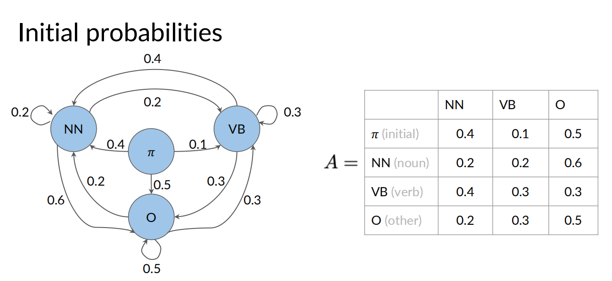
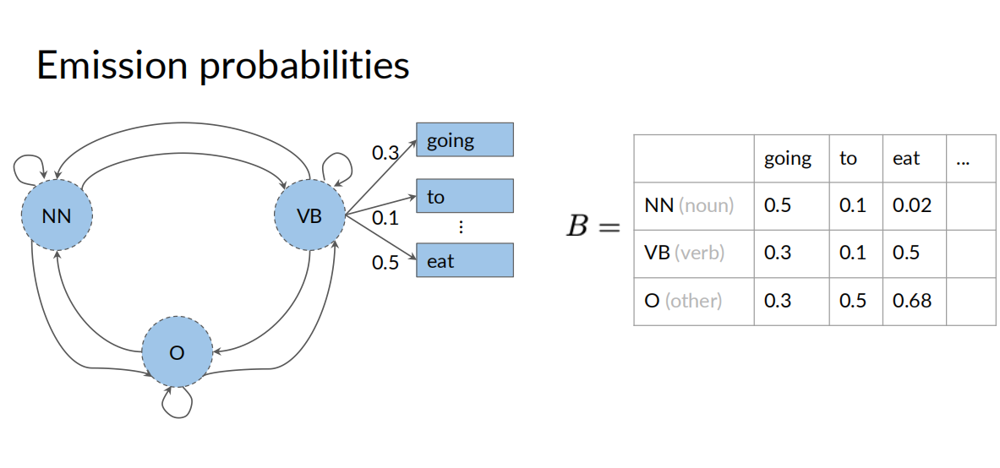
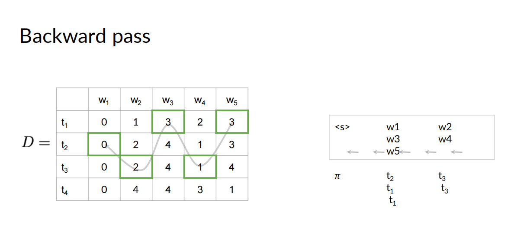
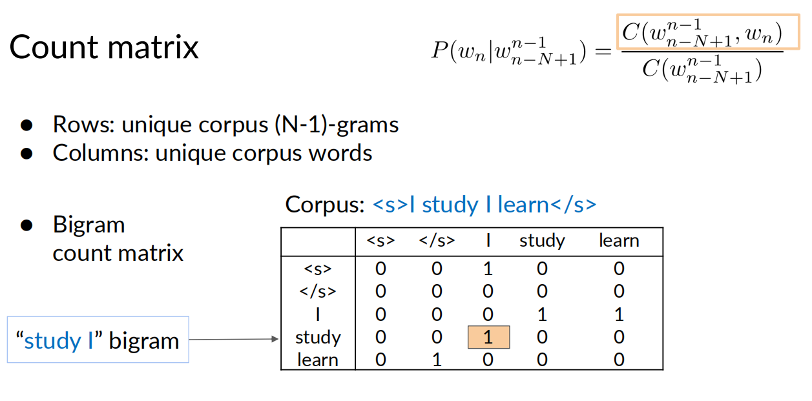
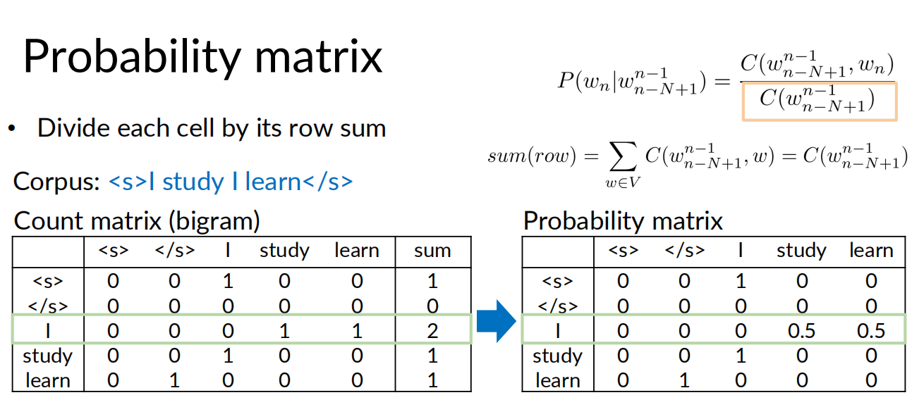
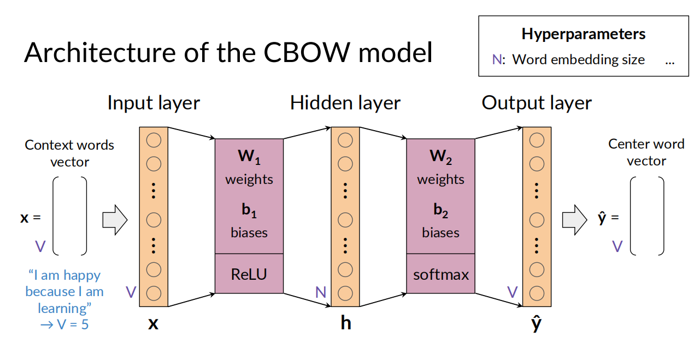
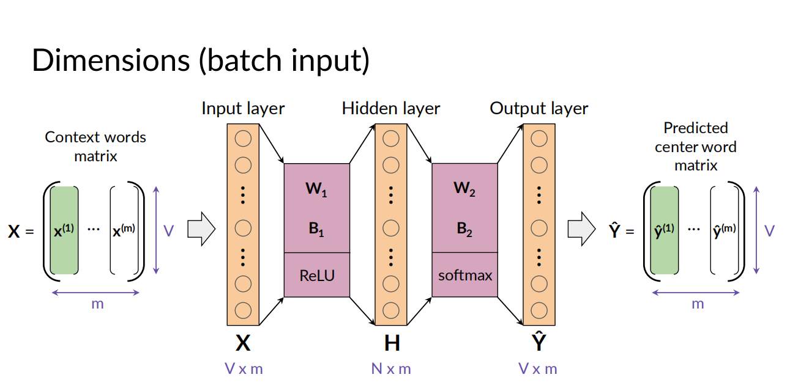
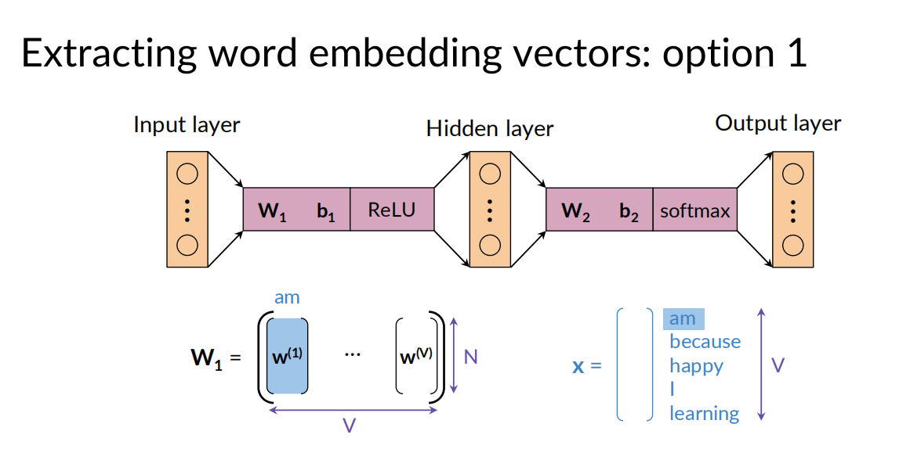
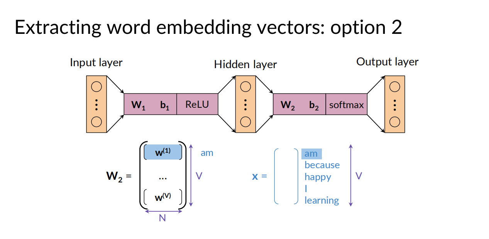
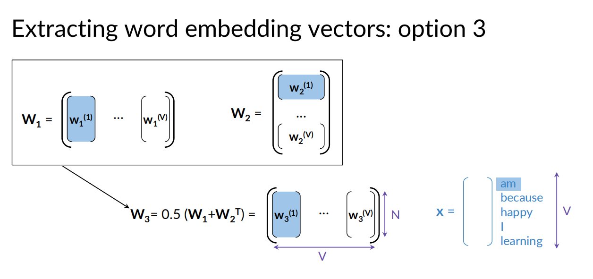

[参考视频](https://www.coursera.org/learn/probabilistic-models-in-nlp/)


- [Week1 Autocorrect](#week1-autocorrect)
  - [How to work](#how-to-work)
    - [1. Identify a misspelled word](#1-identify-a-misspelled-word)
    - [2. Find strings n edit distance away](#2-find-strings-n-edit-distance-away)
    - [3. Filter candidates](#3-filter-candidates)
  - [最小编辑距离](#最小编辑距离)
  - [PA(Autocorrect)](#paautocorrect)
  - [最短编辑距离的计算](#最短编辑距离的计算)
- [Week2 Markov Chains and POS Tags](#week2-markov-chains-and-pos-tags)
  - [Part of speech (POS) tagging](#part-of-speech-pos-tagging)
  - [Markov chains](#markov-chains)
  - [隐马尔可夫模型(HMM)](#隐马尔可夫模型hmm)
  - [计算转移矩阵A(transition matrix)](#计算转移矩阵atransition-matrix)
  - [计算发射矩阵B(emission matrix)](#计算发射矩阵bemission-matrix)
  - [Viterbi 算法](#viterbi-算法)
- [Week3 Autocomplete and Language Models](#week3-autocomplete-and-language-models)
  - [N-grams](#n-grams)
  - [Sequence Probabilities](#sequence-probabilities)
  - [The N-gram Language Model](#the-n-gram-language-model)
  - [语言模型的评价](#语言模型的评价)
  - [词汇表之外的词](#词汇表之外的词)
  - [Smoothing](#smoothing)
  - [PA(Auto-Complete)](#paauto-complete)
- [Word embedding](#word-embedding)
  - [CBOW (Continuous Bag-of-Words Model)](#cbow-continuous-bag-of-words-model)
  - [Data preparation](#data-preparation)
  - [训练模型](#训练模型)
  - [获取词嵌入向量](#获取词嵌入向量)
  - [词向量的评估](#词向量的评估)


## Week1 Autocorrect

文本的自动纠错

### How to work

#### 1. Identify a misspelled word
本节只考虑简单的拼写错误：在给定的字典中找不到的单词。其他的错词，比如根据上下文推断出来的错误，要先不考虑。

#### 2. Find strings n edit distance away
长度为n的编辑距离，编辑方法包括: insert,delete,switch(swap 2 adjacent letters),replace<br>
这步要找到所有可能的n-edit distance的单词，通常n在1-3之间

#### 3. Filter candidates
过滤2中找到的所有词，删掉不在字典中的词

4. Calculate word probabilities
计算每一个词在整个语料库中出现的概率 （感觉这个方法比较粗糙）

### 最小编辑距离

编辑距离（Edit Distance），又称Levenshtein距离，是指两个字串之间，由一个转成另一个所需的最少编辑操作次数。许可的编辑操作包括将一个字符替换成另一个字符，插入一个字符，删除一个字符。一般来说，编辑距离越小，两个串的相似度越大。对于不同的操作类型，可以使用不同的操作次数，比如插入一次算一个操作次数，替换一次算2个操作次数，这是可以自定义的。

计算最小编辑距离的方法就是DP

### PA(Autocorrect)
- 预处理
  - 从语料库获取数据，获取每个单词将其转为小写
  - 计算每个单词的计数
  - 计数每个单词的出现频率
     $P(w_i) = \frac{C(w_i)}{M}$ 
where $C(w_i)$ is the total number of times $w_i$ appears in the corpus.
$M$ is the total number of words in the corpus. M中包含重复单词的重复计数
  - 单词处理（插入/交换相邻/删除/替换），分为一次处理和二次处理
  - 拼写改正的推荐单词的优先级
    * If the word is in the vocabulary, suggest the word. 
    * Otherwise, if there are suggestions from `edit_one_letter` that are in the vocabulary, use those. 
    * Otherwise, if there are suggestions from `edit_two_letters` that are in the vocabulary, use those. 
    * Otherwise, suggest the input word.*  
    * The idea is that words generated from fewer edits are more likely than words with more edits.

### 最短编辑距离的计算
使用DP来计算，用来衡量纠正后的单词和纠正之前的差距
``` python
def min_edit_distance(source, target, ins_cost = 1, del_cost = 1, rep_cost = 2):
    '''
    Input: 
        source: a string corresponding to the string you are starting with
        target: a string corresponding to the string you want to end with
        ins_cost: an integer setting the insert cost
        del_cost: an integer setting the delete cost
        rep_cost: an integer setting the replace cost
    Output:
        D: a matrix of len(source)+1 by len(target)+1 containing minimum edit distances
        med: the minimum edit distance (med) required to convert the source string to the target
    '''
    # use deletion and insert cost as  1
    m = len(source) 
    n = len(target) 
    #initialize cost matrix with zeros and dimensions (m+1,n+1) 
    D = np.zeros((m+1, n+1), dtype=int) 
    
    ### START CODE HERE (Replace instances of 'None' with your code) ###
    
    # Fill in column 0, from row 1 to row m, both inclusive
    for row in range(1,m+1): # Replace None with the proper range
        D[row,0] = D[row-1,0]+del_cost
        
    # Fill in row 0, for all columns from 1 to n, both inclusive
    for col in range(1,n+1): # Replace None with the proper range
        D[0,col] = D[0,col-1]+ins_cost
        
    # Loop through row 1 to row m, both inclusive
    for row in range(1,m+1):
        
        # Loop through column 1 to column n, both inclusive
        for col in range(1,n+1):
            
            # Intialize r_cost to the 'replace' cost that is passed into this function
            r_cost = D[row-1,col-1] + (rep_cost if source[row-1]!=target[col-1] else 0)
            
            # Update the cost at row, col based on previous entries in the cost matrix
            # Refer to the equation calculate for D[i,j] (the minimum of three calculated costs)
            D[row,col] = min(r_cost, D[row-1,col]+del_cost, D[row,col-1]+ins_cost)
            
    # Set the minimum edit distance with the cost found at row m, column n 
    med = D[m,n]
    
    ### END CODE HERE ###
    return D, med
```

## Week2 Markov Chains and POS Tags

### Part of speech (POS) tagging
词性标注

对一段文字的每个词进行标注，这些词可能直接来自于字典，或是有字典中的词添加特殊词性的前后缀得来

可以用以上方式对每个词做出一个标注

### Markov chains
马尔可夫链（Markov Chain）是一种随机过程模型，描述了系统在离散时间内从一个状态转移到另一个状态的概率。其核心特性是马尔可夫性质，即系统的未来状态仅依赖于当前状态，与过去的状态无关。这种“无记忆性”使得马尔可夫链在概率论、机器学习和数据建模中具有广泛的应用。


马尔可夫链由以下要素组成：

- 状态空间：系统可能的所有状态集合。

- 转移概率矩阵：描述从一个状态转移到另一个状态的概率。例如，矩阵中的元素 (P(i, j)) 表示从状态 (i) 转移到状态 (j) 的概率。

- 初始状态分布：系统在初始时刻的状态概率分布。

马尔可夫链的一个重要性质是，当转移概率矩阵满足一定条件时，经过多次状态转移，系统的状态分布会收敛到一个稳定的分布，与初始状态无关。

举例，转移矩阵如下：

一行表示从左侧的状态转移到右侧各个状态的概率，一行之和总为1。$\pi$ 表示初始状态


state :
$Q=\{q_1,q_2,...,q_N\}$

$$ \text{Transition matrix} $$
$$ {A=\begin{Bmatrix}
 a_{1,1} & \dots  & a_{1,N}\\
 \vdots  & \ddots  & \vdots \\
 a_{N,1} & \dots & a_{N,N}
\end{Bmatrix}} $$

### 隐马尔可夫模型(HMM)

HMM 中定义了：
发射概率（Emission Probability）描述了在特定的隐藏状态下生成观测值的可能性。

在隐马尔可夫模型中，发射概率通常由一个发射矩阵表示，矩阵的行代表隐藏状态，列代表观测值，每个元素表示在特定隐藏状态下观测到特定观测值的概率

以下 going/to/eat 这些是可观测的，而动词/名词这些概念是隐状态



转移概率(是离散的(Discrete))，只与前一个状态有关\
$P(q_t|q_{t-1})=P(q_t|q_q,...,q_{t-1},y_1,...,y_{t-1})$

发射概率 (可以是连续的，可以是离散的), 只与前一个隐状态有关\
$P(y_t|q_t)=P(q_t|q_q,...,q_{t-1},q_t,y_1,...,y_{t-1})$

当发射概率是离散是，可以得到一个发射矩阵
$$ \text{Transition matrix} $$
$$ {B=\begin{Bmatrix}
 b_{1,1} & \dots  & b_{1,V}\\
 \vdots  & \ddots  & \vdots \\
 b_{N,1} & \dots & b_{N,V}
\end{Bmatrix}} $$

发射矩阵描述的是，从某个隐状态对应一个观测值的概率。

### 计算转移矩阵A(transition matrix)
根据语料库，计算转移矩阵的每一项，用如下公式：

- count occurrences of tag pairs  $C(t_{i-1},t_i)$
- calculate probability  $P(t_i|t_{i-1})=\frac{C(t_{i-1},t_i)+\epsilon}{ {\textstyle \sum_{j=1}^{N}} C(t_{i-1},t_j)+N*\epsilon}$

$\epsilon$ 是一种避免除以0的平滑技术

### 计算发射矩阵B(emission matrix)
方法与计算转移矩阵类似，把每项换成  $C(t_i,w_i)$\
$P(w_i|t_i)=\frac{C(t_i,w_i)+\epsilon}{ {\textstyle \sum_{j=1}^{V}} C(t_i,w_j)+N*\epsilon}=\frac{C(t_i,w_i)+\epsilon}{ C(t_i)+N*\epsilon}$


### Viterbi 算法
维特比算法是用DP来解决hmm的预测问题（或称为解码问题）的，即给定模型 $\lambda=(A,B,\pi)$和观察序列$O=(o_1,o_2,...,o_T)$,求对给定观察序列条件概率$P=(I|O)$最大的状态序列$I=(i_1,i_2,...,i_T)$

预测问题是hmm模型的3个基本问题之一，其他两个问题课程中没提到，可以参考<<统计学习方法>>。

为了求解这个问题，引入两个辅助矩阵，C和D，它们维度相同，都是N行（隐状态个数），T列（观测序列个数）。\
其中$c_{i,j}$ 表示给定模型$\lambda$，当前j项的观察序列为$O=(o_1,o_2,...,o_j)$，第$j$个观测项的对应的隐状态为$i$的最大概率是多少。\
$d_{i,j}$表示取到最大值为$c_{i,j}$的路径（从i-1）对应的状态值，即从在第j-1步时，从$d_{i,j}$状态到达第j步的i状态能够达到最大的概率$c_{i,j}$

$$ {C=\begin{Bmatrix}
c_{1,1} & \dots  &c_{1,T}\\
 \vdots  & \ddots  & \vdots \\
c_{N,1} & \dots &c_{N,T}
\end{Bmatrix}} 
{D=\begin{Bmatrix}
d_{1,1} & \dots  &d_{1,T}\\
 \vdots  & \ddots  & \vdots \\
d_{N,1} & \dots &d_{N,T}
\end{Bmatrix}}$$

Viterbi 算法分成3步
1. 初始化
   
   计算第一列: \
    $c_{1,i}=\pi_{i}*b_{i,cindex(w_1)}$， 其中$cindex(w_1)$表示w1对应的观测值的下标 \
    $d_{1,i}=0，表示前一项都是0（ $\pi$ 状态)

2. 向前递推

    对每个$1\le i\le N$ 和$j\gt 0$
   
   $c_{i,j}=\max\limits_{1\le k\le N}c_{k,j-1}\cdot a_{k,i}\cdot b_{i,\mathrm{cindex}(w_j)}$ \
   $d_{i,j}=\argmax\limits_{1\le k\le N}c_{k,j-1}\cdot a_{k,i}\cdot b_{i,cindex(w_j)}$

3. 反向递推
   
    根据D矩阵，从最后一列向前依次递推，获取最大每个i对应的最大概率的隐状态下标
    

实际计算过程中使用log函数，避免相乘之后的数值太小而丢失精度

$log(c_{i,j})=\max\limits_{1\le k\le N}log(c_{k,j-1})+ log(a_{k,i}) +log(b_{i,\mathrm{cindex}(w_j)})$


## Week3 Autocomplete and Language Models

### N-grams

N-gram是一种基于统计语言模型的算法，用于预测文本中的单词，其中 N  一般指的是序列中的单词数量。其基本思想是将文本内容进行大小为 N 的滑动窗口操作来计算概率。

- N=1：unigram
- N=2: bigram
- N=3: trigram

记号： $w_1^m=w_1w_2...w_m$  表示从单词$w_1$到$w_m$这连续的m个单词

unigram的概率 $P(w)=\frac{C(w)}{m}$ \
bigram的概率 $P(y|x)=\frac{C(xy)}{C(x)}$ 其中 C(x) 表示预料中x出现的次数 \
trigram的概率 $P(w_3|w_1^2)=\frac{C(w_1^2w_3)}{C(w_1^2)}=\frac{C(w_1^3)}{C(w_1^2)}$ 其中 C(x) 表示预料中x出现的次数

一般的， $P(w_n|w_1^{n-1})=\frac{C(w_1^{n-1}w_N)}{C(w_1^{N-1})}=\frac{C(w_1^N)}{C(w_1^{N-1})}$


### Sequence Probabilities

考虑一句话出现的概率，应该等于一组条件概率的乘积，如：
$\text{P(the teacher drinks tea)=P(the)P(teacher|the)P(drinks|the teacher)P(tea|the teacher drinks)}$，其中$\text{P(tea|the teacher drinks)=P(the teacher drinks tea)/P(the teacher drinks)}$

而当这句话越来越长时，P(the teacher drinks tea)和P(the teacher drinks)都可能为0，使得计算出现问题，此时可以考虑使用近似值$P(tea|\hbox{the teacher drinks})\approx P(tea|drinks)$，这里使用了bigram近似，或者使用其他N-gram做近似处理。

对于一个句子的开头和结尾的处理，可以为语料库的每句话，加上一个开始符 \<s> 和结束符 \</s>
在实际操作中开始符可能是多个（bigram是一个，trigram是二个...）,结束符只需要一个就够了

\<s> the teacher drinks tea \<\s>
在bigram下，整句话出现的概率可以表示为 $P(the|\hbox{<s>})P(teacher|the)P(drinks|teacher)P(tea|drinks)P(\hbox{</s>}|tea)$

### The N-gram Language Model

两个矩阵，定义如下，**count matrix** / **probability matrix**




有了概率矩阵，就能做两件事了
  - 计算一句话出现的概率
  - 给定一个句子开头，预测 next word

一个句子的概率由下式近似给出
$$ P(w_1^{n})\approx \prod_{i=1}^{n} P(w_i|w_{i-1})  $$
计算时，通常使用它的对数形式，避免精度问题
$$ log(P(w_1^{n}))\approx \sum_{i=1}^{n} log(P(w_i|w_{i-1}))  $$


生成式语言模型的基本算法
1. Choose sentence start
2. Choose next bigram starting with previous word
3. Continue until \</s> is picked


### 语言模型的评价

划分训练集/验证集/测试集

**困惑度(Perplexity)**
困惑度有如下定义：
$$ PP(W) = P(s_1,s_2,...s_m)^{-\frac{1}{m}} $$
其中W表示测试集包含的所有m个句子s
m是测试集W中包含的所有词的数量（包含\</s>,不含\<s>）

为何句子的数量和词的数量都是m？？

对于一个句子
$$ PP(W_i) = \sqrt[m]{\prod_{j=1}^{|s_i|} \frac{1}{P(w_j^{(i)}|w_{j-1}^{(i)})}} $$
$$ w_j^{(i)} -> \text{ j-th word in i-th sentence} $$

将m个句子合起来，
$$ PP(W) = \sqrt[m]{\prod_{i=1}^{m}\prod_{j=1}^{|s_i|} \frac{1}{P(w_j^{(i)}|w_{j-1}^{(i)})}} =\sqrt[m]{\prod_{i=1}^{m} \frac{1}{P(w_i|w_{i-1})}}$$
$$ w_i -> \text{ i-th word in test set} $$

困惑度的log形式
$$ logPP(W)=-\frac{1}{m}\sum_{i=1}^{m}\log_2(P(w_i|w_{i-1})) $$

**更小困惑度代表更优的模型表现**，大约20~60的困惑度是比较好的模型了。


### 词汇表之外的词


随着模型规模的不断扩大，出现了一种新的问题：OOV（Out-of-Vocabulary，词汇库外）问题。OOV问题是指模型在处理文本数据时，遇到了未在词汇库中出现过的词汇，导致模型无法理解这些词汇，从而影响了模型的性能。

对于这些词，我们在语料库中，将其替换为一个特殊的Tag: **\<UNK>**
- 创建一个单词表V
- 替换调corpus中不在V的所有单词为\<UNK>
- 计算\<UNK>与其他单词的相关概率

如何选择单词表，可以有两种原则：
- 制定一个最小频率，在corpus中的词的频率需要达到一个数值，才能放入单词表
- 制定|V|的最大值，优先选择频率大的单词放入

### Smoothing
训练集中，在计算条件概率中可能会出现分母为0的场景，如：N-grams made of known words still might be missing in the training corpus

$$ P(w_n|w_{n-N+1}^{n-1})=\frac{C(w_{n-N+1}^{n-1},w_N)}{C(w_{n-N+1}^{N-1})} $$

此式子右边分子分母都可能为0，同样在处理时引入Laplacian smoothing

- Add-one smoothing
  
$$ P(w_n|w_{n-1})=\frac{C(w_{n-1},w_n) + 1}{\sum_{w\in V}(C(w_{n-1},w) + 1)}=\frac{C(w_{n-1},w_n) + 1}{C(w_{n-1}) + V} $$

- Add-k smoothing
  
$$ P(w_n|w_{n-1})=\frac{C(w_{n-1},w_n) + k}{\sum_{w\in V}(C(w_{n-1},w) + k)}=\frac{C(w_{n-1},w_n) + k}{C(w_{n-1}) + kV} $$

另外两种smoothing的方法：
backoff/插值

### PA(Auto-Complete)

- 预处理数据
  * 切分句子
  * tokenize (nltk.word_tokenize)
  * 所有单词计数
  * 按单词频率超过n的单词构造单词表
  * 替换非单词表的单词为unk
  * 切分数据集为训练集和测试集
      * 其中单词频率和选择是在训练集上进行的，但单词替换是对训练集+测试集
- 按照 Add-k smoothing 计算 $P(w_n|w_{n-1})$
- 评估模型，计算困惑度
- 计算补全的词，从概率最高的单词：

```python
def suggest_a_word(previous_tokens, n_gram_counts, n_plus1_gram_counts, vocabulary, end_token='<e>', unknown_token="<unk>", k=1.0, start_with=None):
    """
    Get suggestion for the next word
    
    Args:
        previous_tokens: The sentence you input where each token is a word. Must have length >= n 
        n_gram_counts: Dictionary of counts of n-grams
        n_plus1_gram_counts: Dictionary of counts of (n+1)-grams
        vocabulary: List of words
        k: positive constant, smoothing parameter
        start_with: If not None, specifies the first few letters of the next word
        
    Returns:
        A tuple of 
          - string of the most likely next word
          - corresponding probability
    """
    
    # length of previous words
    n = len(list(n_gram_counts.keys())[0])
    
    # append "start token" on "previous_tokens"
    previous_tokens = ['<s>'] * n + previous_tokens
    
    # From the words that the user already typed
    # get the most recent 'n' words as the previous n-gram
    previous_n_gram = previous_tokens[-n:]

    # Estimate the probabilities that each word in the vocabulary
    # is the next word,
    # given the previous n-gram, the dictionary of n-gram counts,
    # the dictionary of n plus 1 gram counts, and the smoothing constant
    probabilities = estimate_probabilities(previous_n_gram,
                                           n_gram_counts, n_plus1_gram_counts,
                                           vocabulary, k=k)
    
    # Initialize suggested word to None
    # This will be set to the word with highest probability
    suggestion = None
    
    # Initialize the highest word probability to 0
    # this will be set to the highest probability 
    # of all words to be suggested
    max_prob = 0
    
    ### START CODE HERE ###
    
    # For each word and its probability in the probabilities dictionary:
    for word, prob in probabilities.items(): # complete this line
        
        # If the optional start_with string is set
        if start_with: # complete this line with the proper condition
            
            # Check if the beginning of word does not match with the letters in 'start_with'
            if not word.startswith(start_with): # complete this line with the proper condition

                # if they don't match, skip this word (move onto the next word)
                continue
        
        # Check if this word's probability
        # is greater than the current maximum probability
        if prob > max_prob: # complete this line with the proper condition
            
            # If so, save this word as the best suggestion (so far)
            suggestion = word
            
            # Save the new maximum probability
            max_prob = prob

    ### END CODE HERE
    
    return suggestion, max_prob
```

## Word embedding

词表示的方法
- integers 不能体现词之间的内在关系
- one hot vectors  不能体现词之间的内在关系，向量空间太大
- word embeddings

一些基础的word embedding方法
- word2vec(Google)
- GloVe(Stanford)
- fastText(Fackbook)

一些高级的word embedding方法
- BERT (Google)
- ELMo
- GPT


### CBOW (Continuous Bag-of-Words Model)

CBOW的基本思想是，给定一个单词的上下文（即窗口内的其他单词），预测该单词本身。例如，对于句子“The cat climbed up the tree”，如果窗口大小为5，那么当中心单词为“climbed”时，上下文单词为“The”、“cat”、“up”和“the”。CBOW模型要求根据这四个上下文单词，计算出“climbed”的概率分布。

### Data preparation
- Cleaning and tokenization 
  - 大小写转换，标点处理，特殊字符的处理
- Sliding window of words
  - 通过滑窗技巧，提取出每个中心词和滑窗中周围的词
  
```python
# Define the 'get_windows' function
# C 是窗口中单词的数量
def get_windows(words, C):
    i = C
    while i < len(words) - C:
        center_word = words[i]
        context_words = words[(i - C):i] + words[(i+1):(i+C+1)]
        yield context_words, center_word
        i += 1
```
- Transforming words into vectors for the training set
  - 把训练集中的词都转成one-hot word vectors
    - 中心词是一个单独的 one-hot word vectors
    - 周围词是把周围词的 one-hot word vectors 都加起来做平均
```
效果大概这样：
Context words vector:  [0.25 0.25 0.   0.5  0.  ]
Center word vector:  [0. 0. 1. 0. 0.]

Context words vector:  [0.5  0.   0.25 0.25 0.  ]
Center word vector:  [0. 1. 0. 0. 0.]

Context words vector:  [0.25 0.25 0.25 0.   0.25]
Center word vector:  [0. 0. 0. 1. 0.]
```

### 训练模型
模型是一个3层的全连接神经网络，输入就是上面计算出来的Context words vector，输出层的期望是Center word vector，两个激活函数分别是Relu和softmax, 如下图：



批量训练的版本为：


损失函数，使用交叉熵损失函数

训练的过程就是普通的神经网络训练方式：方向传播 + 梯度下降的方式


### 获取词嵌入向量
根据上面的模型计算出一组神经网络的参数 $[W_1,b_1,W_2,b_2]$ \
如何根据这种参数生成词嵌入向量呢？有三种方式:
- $W_1$
- $W_2$
- $0.5(W_1+W_2^T)$





### 词向量的评估
Intrinsic 和 Extrinsic 通常指两种不同的评估方式

- Intrinsic（内在评估）

   - 目标：直接、独立地评估词向量本身的质量，不依赖具体下游任务。
   - 常见方法：
     - 词语相似度/相关性数据集（如 WordSim-353、SimLex-999、MEN）：计算词向量的余弦相似度，与人工标     - 注的相似度做相关性（Spearman/Pearson）。
     - 类比任务（Mikolov analogies，例如 king - man + woman ≈ queen）：测试向量空间的几何结构是否     - 表达语义/语法规律。
     - 最近邻检查、聚类纯度、语义类别一致性。
     - 语言学 probing（例如利用线性分类器探测是否编码了词性、形态信息）。
   - 优点：快速、成本低、可控变量多（可以只比较嵌入差异）。
   - 局限：与实际任务表现不一定强相关；可能受评测集题型偏好影响（如过度重视几何线性性质）。

 - Extrinsic（外在评估）
    - 目标：把词向量用于真实的下游任务，观察对任务性能的影响。
    - 常见任务：
      - 文本分类、情感分析
      - 序列标注（NER、POS 标注）
      - 机器翻译、问答、信息检索
   - 实践方式：
    将 CBOW 词向量作为特征输入下游模型（可选择冻结或微调），比较不同嵌入对最终指标（准确率、F1、BLEU 等）的影响。
    - 优点：直接反映对业务或应用的价值，综合考虑与数据分布、模型结构的互动。
   - 局限：成本高、变量多（模型结构、训练策略、数据规模等），难以隔离“词向量本身”的贡献。

