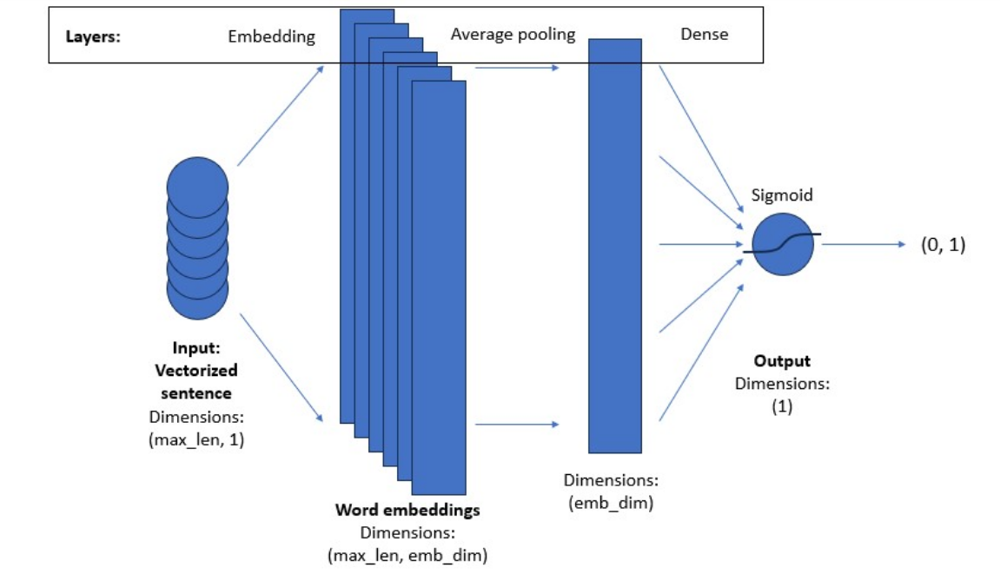

[参考视频](https://www.coursera.org/learn/sequence-models-in-nlp/)

- [PA1 (Sentiment with Deep Neural Networks)](#pa1-sentiment-with-deep-neural-networks)
  - [模型](#模型)


## PA1 (Sentiment with Deep Neural Networks)


 - 导入数据
 - 格式化数据，分割单词，去掉标点。。。
 - 分割训练集(8000)和验证集(2000)
 - build vocabulary 基于训练集为每个单词生成一个index，不在训练集中的使用一个特殊记号 **[UNK]**, **[UNK]** 也会被分配一个id，同理还有padding串，此表大小用 **num_words** 表示
 - Convert a Tweet to a Tensor  按最长的tweet的长度(**max_len**)，作为每个tensor的固定长度，不足的用padding补齐
 - 构建模型，一个嵌入层，一个平均池化层，一个Dense层

### 模型

**Embedding层**

输入: 
一个句子，最大长度为**max_len**，不足 max_len 用0补足长度，每一个维度是一个单词，采用one-hot的方式表示

输出：
一个(max_len, emb_dim)维度的矩阵，每个单词变成了一个维度是emb_dim的词向量


Embedding 层的核心作用是将离散索引转换为可训练的低维稠密向量表示，为神经网络提供有语义、可微的输入表征，从而高效地处理文本、ID 等离散特征。


**Dense 层**
 
 对输入的最后一维做仿射变换（线性变换加偏置），再施加激活函数。公式为 y = activation(x · W + b)，其中 W 形状为 (input_features, units)，b 形状为 (units)。是神经网络中最基本的“全连接层”，负责将输入特征通过线性变换和非线性激活进行组合与映射，是分类、回归和通用特征变换的核心组件。



```python
# GRADED FUNCTION: create_model
def create_model(num_words, embedding_dim, max_len):
    """
    Creates a text classifier model
    
    Args:
        num_words (int): size of the vocabulary for the Embedding layer input
        embedding_dim (int): dimensionality of the Embedding layer output
        max_len (int): length of the input sequences
    
    Returns:
        model (tf.keras Model): the text classifier model
    """
    
    tf.random.set_seed(123)
    
    ### START CODE HERE
    
    model = tf.keras.Sequential([ 
        tf.keras.layers.Embedding(num_words, embedding_dim, input_length=max_len),
        tf.keras.layers.GlobalAveragePooling1D(),
        tf.keras.layers.Dense(1,activation='sigmoid')
    ]) 
    
    model.compile(loss='binary_crossentropy',
                  optimizer='adam',
                  metrics=['accuracy'])

    ### END CODE HERE

    return model

model = create_model(num_words=num_words, embedding_dim=16, max_len=max_len)

# 启动训练
history = model.fit(train_x_prepared, train_y_prepared, epochs=20, validation_data=(val_x_prepared, val_y_prepared))

# 模型预测
# Prepare an example with 10 positive and 10 negative tweets.
example_for_prediction = np.append(val_x_prepared[0:10], val_x_prepared[-10:], axis=0)

# Make a prediction on the tweets.
model.predict(example_for_prediction)
```
