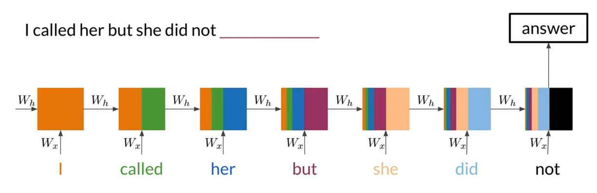
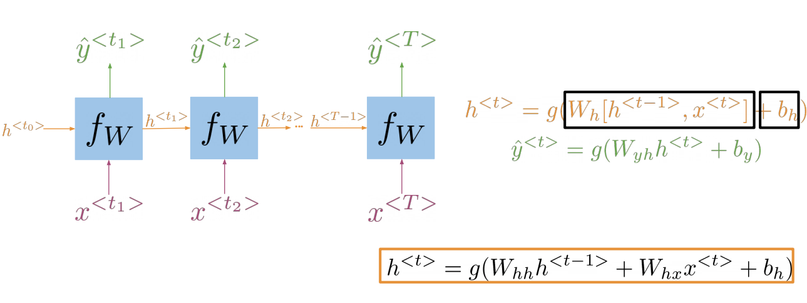
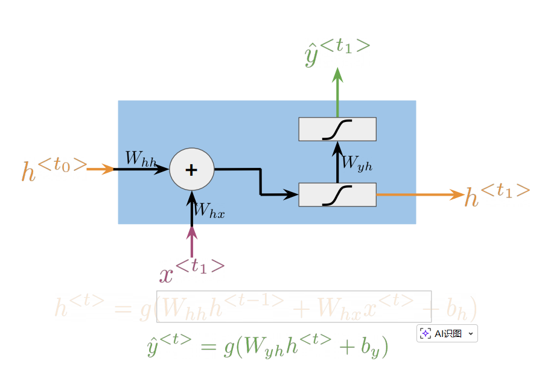
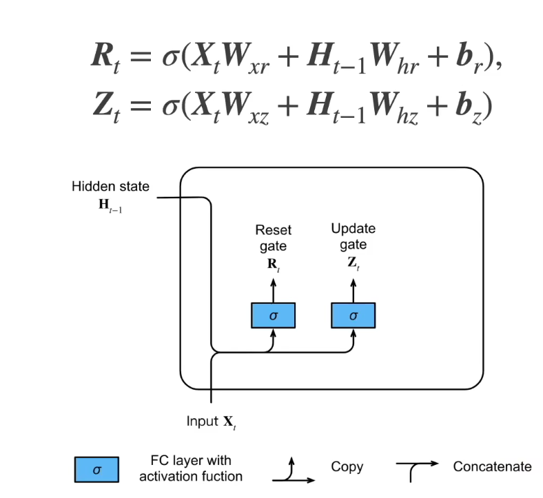
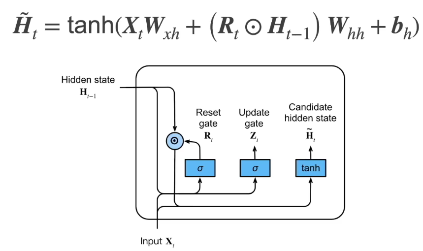
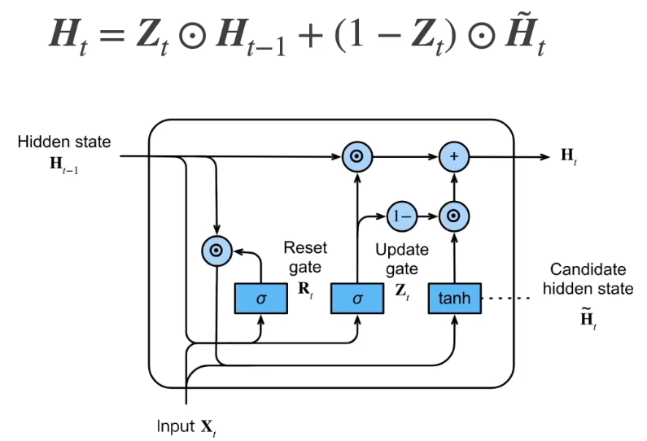

[参考视频](https://www.coursera.org/learn/sequence-models-in-nlp/)

- [PA1 (Sentiment with Deep Neural Networks)](#pa1-sentiment-with-deep-neural-networks)
  - [模型](#模型)
- [RNN vs N-grams](#rnn-vs-n-grams)
- [Vanilla RNN](#vanilla-rnn)
- [GRU(Gated Recurrent Unit)](#grugated-recurrent-unit)
- [PA2 Deep N-grams](#pa2-deep-n-grams)
- [LSTM](#lstm)


## PA1 (Sentiment with Deep Neural Networks)


 - 导入数据
 - 格式化数据，分割单词，去掉标点。。。
 - 分割训练集(8000)和验证集(2000)
 - build vocabulary 基于训练集为每个单词生成一个index，不在训练集中的使用一个特殊记号 **[UNK]**, **[UNK]** 也会被分配一个id，同理还有padding串，此表大小用 **num_words** 表示
 - Convert a Tweet to a Tensor  按最长的tweet的长度(**max_len**)，作为每个tensor的固定长度，不足的用padding补齐
 - 构建模型，一个嵌入层，一个平均池化层，一个Dense层

### 模型

**Embedding层**

输入: 
一个句子，最大长度为**max_len**，不足 max_len 用0补足长度，每一个维度是一个单词，采用一个数字表示（对应vocabulary的值）

输出：
一个(max_len, emb_dim)维度的矩阵，每个单词变成了一个维度是emb_dim的词向量


Embedding 层的核心作用是将离散索引转换为可训练的低维稠密向量表示，为神经网络提供有语义、可微的输入表征，从而高效地处理文本、ID 等离散特征。


**Dense 层**
 
 对输入的最后一维做仿射变换（线性变换加偏置），再施加激活函数。公式为 y = activation(x · W + b)，其中 W 形状为 (input_features, units)，b 形状为 (units)。是神经网络中最基本的“全连接层”，负责将输入特征通过线性变换和非线性激活进行组合与映射，是分类、回归和通用特征变换的核心组件。


```python
# GRADED FUNCTION: create_model
def create_model(num_words, embedding_dim, max_len):
    """
    Creates a text classifier model
    
    Args:
        num_words (int): size of the vocabulary for the Embedding layer input
        embedding_dim (int): dimensionality of the Embedding layer output
        max_len (int): length of the input sequences
    
    Returns:
        model (tf.keras Model): the text classifier model
    """
    
    tf.random.set_seed(123)
    
    ### START CODE HERE
    
    model = tf.keras.Sequential([ 
        tf.keras.layers.Embedding(num_words, embedding_dim, input_length=max_len),
        tf.keras.layers.GlobalAveragePooling1D(),
        tf.keras.layers.Dense(1,activation='sigmoid')
    ]) 
    
    model.compile(loss='binary_crossentropy',
                  optimizer='adam',
                  metrics=['accuracy'])

    ### END CODE HERE

    return model

model = create_model(num_words=num_words, embedding_dim=16, max_len=max_len)

# 启动训练
history = model.fit(train_x_prepared, train_y_prepared, epochs=20, validation_data=(val_x_prepared, val_y_prepared))

# 模型预测
# Prepare an example with 10 positive and 10 negative tweets.
example_for_prediction = np.append(val_x_prepared[0:10], val_x_prepared[-10:], axis=0)

# Make a prediction on the tweets.
model.predict(example_for_prediction)
```

## RNN vs N-grams
传统的N-grams如果要获取在句子之中相距较远的两个次之间的关系，N要设置的很大 \
当N很大时，N-grams需要计算很大的条件概率，这对内存和硬盘的消耗量就非常大

RNN能够将一句话中较远的词信息向后传递很远的距离(当然，距离越远保留的信息占比越少)，以下是RNN的神经元信息传递的简图


RNN 在 one to many/many to one /many to many 的场景都能适用

## Vanilla RNN

Vanilla RNN（最基本的循环神经网络）是一类用于建模序列数据的神经网络，其核心在于通过隐藏状态在时间维度上传递信息，实现对序列依赖的建模。

核心结构

在时间步 $t$，模型接收当前输入 $x^{<t>}$ 和上一步的隐藏状态 $h^{<t-1>}$，计算新的隐藏状态 $h^{<t>}$，并可产生输出 $\hat{y}^{<t>}$。
参数在所有时间步共享，因此可处理可变长度序列。



具体展开一个单元格如下



其中 $W_{hh}: (d_h,d_h)$ , $W_{xh}: (d_h, d_{in})$, $W_{yh}: (d_{out}, d_h)$, $b_{h}: (d_h)$, $b_{y}: (d_{out})$ 都是需要学习的重要参数(括号中是它们的维度)

## GRU(Gated Recurrent Unit)
GRU是一种带门控机制的循环神经网络单元，旨在缓解普通 RNN 的梯度消失问题，更好地捕捉长程依赖，同时保持相对较低的参数量和计算开销。

其主要包括输入变量、隐状态($H_{t_i}$)、重置门($R_t$)、更新门($Z_t$)、候选隐状态($\tilde{H_i}$)以及激活函数几部分。





以上三个图展示了GRU的过程
[李沐视频](https://www.bilibili.com/video/BV1mf4y157N2/?spm_id_from=333.337.search-card.all.click&vd_source=841d763fe9132a9c849a39245e699de4)

($\odot$ 表示按元素依次相乘)

两个特殊场景，退化为RNN
- 当重置门($R_t$)为1，候选隐状态($\tilde{H_i})$就是RNN的递推公式
- 当重置门($R_t$)为1，更新门($Z_t$)为0，隐状态($H_{t_i}$)就是RNN的递推公式

重置门($R_t$)和更新门($Z_t$)在维度上都是与隐状态($H_{t_i}$)及候选隐状态($\tilde{H_i})$相同的\
重置门($R_t$)和更新门($Z_t$) 中的每个数值都在[0,1]之间，用于表示"选取比例"

GRU就是增加了两个门，从而增加了一系列可以学习到的参数，通过“更新门”和“重置门”建立了近似“加性”的状态通路，缓解梯度消失问题，使信息可以在较长时间跨度上保留。更新门允许“跳过”不必要的更新，让有用的记忆在多步中持续存在。**重置门可以在需要时“忘记”历史，只用当前输入建模短期模式；更新门则在需要时保持长期记忆，兼顾短期与长期依赖。**

简单说就是在一个长序列中，自动学习到哪些参数要更长的传递下去，哪些信息可以及时舍去。


## PA2 Deep N-grams
- Data Preprocessing
  - Dataset Import:
  - Data Storage
  - Character-Level Processing (注意是字符级的，不是单词级的)
    - tf.keras.layers.StringLookup 函数可以把一个字典中的每个字都映射成一个唯一数字，并输出一个tensor。同时这个函数也可以有反向的变换，使用参数invert=True
  - TensorFlow Dataset Creation
    - 需要把整片文章连成一个很长的句子，用tensorflow的方法，定义一个generator，每次可以生成n个batch，每个batch长度为seq_length+1的一组字符
- Dataset Creation

```python
# GRADED FUNCTION: create_batch_dataset
def create_batch_dataset(lines, vocab, seq_length=100, batch_size=64):
    """
    Creates a batch dataset from a list of text lines.

    Args:
        lines (list): A list of strings with the input data, one line per row.
        vocab (list): A list containing the vocabulary.
        seq_length (int): The desired length of each sample.
        batch_size (int): The batch size.

    Returns:
        tf.data.Dataset: A batch dataset generator.
    """
    # Buffer size to shuffle the dataset
    # (TF data is designed to work with possibly infinite sequences,
    # so it doesn't attempt to shuffle the entire sequence in memory. Instead,
    # it maintains a buffer in which it shuffles elements).
    BUFFER_SIZE = 10000
    
    # For simplicity, just join all lines into a single line
    single_line_data  = "\n".join(lines)

    ### START CODE HERE ###
    
    # Convert your data into a tensor using the given vocab
    all_ids = line_to_tensor('\n'.join(lines), vocab)  # 拼接成一个大句子，all_ids中每项是一个字母对应的ID
    # Create a TensorFlow dataset from the data tensor
    ids_dataset = tf.data.Dataset.from_tensor_slices(all_ids)  # 创建dataset，这个dataset就能从中按批次取指定数量的字符
    # Create a batch dataset
    data_generator = ids_dataset.batch(seq_length + 1, drop_remainder=True) # 定义generator
    # Map each input sample using the split_input_target function
    dataset_xy = data_generator.map(split_input_target)  # 从一个batch取出的一组字符，按split_input_target函数，分解成两个部分，这两部分一个是input，另一个是output，实际就是一对(input, output)
    
    # Assemble the final dataset with shuffling, batching, and prefetching
    dataset = (                                   
        dataset_xy                                
        .shuffle(BUFFER_SIZE)  # 对所有(input, output)对进行随机打乱
        .batch(batch_size, drop_remainder=True)  # 每次取出 batch_size 对
        .prefetch(tf.data.experimental.AUTOTUNE)  
        )            
    # 预取（prefetch）
    # 预取的作用：在训练（GPU/TPU 进行前向/反向）时，CPU 在后台并行准备下一个 batch（例如解码、切片、拷贝等），从而把数据准备和训练计算重叠，减少输入等待时间，提高吞吐。
    # tf.data.AUTOTUNE 会让 TensorFlow 根据系统资源自动选择一个合适的预取缓冲区大小，通常是最省心的配置。
    # 预取一般放在流水线末尾，以覆盖上游所有处理的耗时。
    ### END CODE HERE ###
    
    return dataset
```

- Defining the GRU Language Model，一个三层模型如下

```python
# GRADED CLASS: GRULM
class GRULM(tf.keras.Model):
    """
    A GRU-based language model that maps from a tensor of tokens to activations over a vocabulary.

    Args:
        vocab_size (int, optional): Size of the vocabulary. Defaults to 256.
        embedding_dim (int, optional): Depth of embedding. Defaults to 256.
        rnn_units (int, optional): Number of units in the GRU cell. Defaults to 128.

    Returns:
        tf.keras.Model: A GRULM language model.
    """
    def __init__(self, vocab_size=256, embedding_dim=256, rnn_units=128):
        super().__init__(self)

        ### START CODE HERE ###

        # Create an embedding layer to map token indices to embedding vectors
        self.embedding = tf.keras.layers.Embedding(vocab_size, embedding_dim)
        # Define a GRU (Gated Recurrent Unit) layer for sequence modeling
        self.gru = tf.keras.layers.GRU(rnn_units, return_sequences = True, return_state = True)
        # Apply a dense layer with log-softmax activation to predict next tokens
        self.dense = tf.keras.layers.Dense(units = vocab_size, activation=tf.nn.log_softmax)
        
        ### END CODE HERE ###
    
    def call(self, inputs, states=None, return_state=False, training=False):
        x = inputs
        # Map input tokens to embedding vectors
        x = self.embedding(x, training=training)
        if states is None:
            # Get initial state from the GRU layer
            states = self.gru.get_initial_state(x)
        x, states = self.gru(x, initial_state=states, training=training)
        # Predict the next tokens and apply log-softmax activation
        x = self.dense(x, training=training)
        if return_state:
            return x, states
        else:
            return x

# Length of the vocabulary in StringLookup Layer
vocab_size = 82

# The embedding dimension
embedding_dim = 256

# RNN layers
rnn_units = 512

model = GRULM(
    vocab_size=vocab_size,
    embedding_dim=embedding_dim,
    rnn_units = rnn_units)

def compile_model(model):
    """
    Sets the loss and optimizer for the given model

    Args:
        model (tf.keras.Model): The model to compile.

    Returns:
        tf.keras.Model: The compiled model.
    """
    ### START CODE HERE ###

    # Define the loss function. Use SparseCategoricalCrossentropy 
    # 多分类任务常用的交叉熵损失
    # 为什么要设置 from_logits=True：告诉损失函数“模型输出不是归一化的概率分布”。常见做法是让模型最后一层输出未归一化的分数（logits），损失内部会自己做 softmax 再算交叉熵，数值更稳定。
    # 现在的模型最后一层输出的是 log_softmax 激活函数
    loss = tf.keras.losses.SparseCategoricalCrossentropy(from_logits=True)
    # Define and Adam optimizer
    opt = tf.keras.optimizers.Adam(learning_rate = 0.00125)
    # Compile the model using the parametrized Adam optimizer and the SparseCategoricalCrossentropy funcion
    model.compile(optimizer=opt, loss=loss)
    
    ### END CODE HERE ###

    return model

```

- Evaluating using the Deep Nets

采用困惑度来衡量

$$\log P(W) = {\log\left(\sqrt[N]{\prod_{i=1}^{N} \frac{1}{P(w_i| w_1,...,w_{i-1})}}\right)}$$
$$ = \log\left(\left(\prod_{i=1}^{N} \frac{1}{P(w_i| w_1,...,w_{i-1})}\right)^{\frac{1}{N}}\right) $$
$$ = \log\left(\left({\prod_{i=1}^{N}{P(w_i| w_1,...,w_{i-1})}}\right)^{-\frac{1}{N}}\right)$$
$$ = -\frac{1}{N}{\log\left({\prod_{i=1}^{N}{P(w_i| w_1,...,w_{i-1})}}\right)} $$
$$ = -\frac{1}{N}{{\sum_{i=1}^{N}{\log P(w_i| w_1,...,w_{i-1})}}} $$

以下计算困惑度的函数，入参 preds 是计算值， target 是实际值，具体如下：
- $preds$ 形状 $[batch, seq\_len, vocab]$，每个位置是对各词的“对数概率”（$\log p$）。
- $target$ 形状 $[batch, seq\_len]$ 每个位置是目标 token 的 **id**；id=1 的位置是 padding，需要在计算中忽略。

```python
def log_perplexity(preds, target):
    """
    Function to calculate the log perplexity of a model.

    Args:
        preds (tf.Tensor): Predictions of a list of batches of tensors corresponding to lines of text.
        target (tf.Tensor): Actual list of batches of tensors corresponding to lines of text.

    Returns:
        float: The log perplexity of the model.
    """
    PADDING_ID = 1
    
    ### START CODE HERE ###
    
    # Calculate log probabilities for predictions using one-hot encoding
    # tf.one_hot(target, depth=preds.shape[-1])：把目标 token 的索引 target 转成 one-hot 向量，维度变为 [batch_size, seq_len, vocab_size]，其中目标词的位置为1，其余为0。depth 取 preds 的最后一维大小，即词表大小 vocab_size。
    # 与 preds 相乘：，每个位置上是各词的对数概率（log p(w|context)）。将 one-hot 与 preds 按元素相乘，会把非目标词的对数概率清零，只保留目标词的对数概率。
    # np.sum(..., axis=-1)：在最后一维（vocab 维）做求和，由于只有目标词位置是非零，这个求和的结果就是每个位置的“目标词的对数概率”。因此 log_p 的形状是 [batch_size, seq_len]。
    log_p = np.sum(tf.one_hot(target, depth=preds.shape[-1]) * preds, axis= -1) # HINT: tf.one_hot(...) should replace one of the Nones
    # Identify non-padding elements in the target


    # np.equal(target, PADDING_ID)：对 target 中每个位置做比较，得到一个布尔矩阵，形状为 [batch_size, seq_len]。在 target 等于 PADDING_ID（这里是1）的地方为 True，表示该位置是 padding。
    # 1.0 - ...：把布尔值转成数值掩码：True 当作 1，False 当作 0（或先转成浮点），再用 1.0 去减。这样 padding 位置会变成 0，非 padding 位置会变成 1。最终得到一个浮点掩码矩阵 non_pad，值为 1 的地方表示有效 token，值为 0 的地方表示 padding。
    # 与困惑度的关系：困惑度应只在真实 token 上计算，忽略 padding。这个掩码用于后面屏蔽 padding 的 log 概率，并在归一化时只统计有效 token 的个数，避免 padding 稀释或干扰损失/困惑度的计算。
    non_pad = 1.0 - np.equal(target, PADDING_ID)          # You should check if the target equals to PADDING_ID


    # Apply non-padding mask to log probabilities to exclude padding
    # 这是把上一句得到的非 padding 掩码 non_pad 应用到每个位置的目标词对数概率 log_p 上。两者形状一致（都为 [batch_size, seq_len]），按元素相乘。
    # 在非 padding 的位置，non_pad 为 1，log_p 保持原值；在 padding 的位置，non_pad 为 0，log_p 被置为 0。
    # 作用是“屏蔽”掉填充位置的对数概率，使后续求和与平均时不把填充位置计入，从而只基于有效 token 计算负对数似然与困惑度。
    log_p = log_p * non_pad                             # Get rid of the padding


    # Calculate the log perplexity by taking the sum of log probabilities and dividing by the sum of non-padding elements
    # np.sum(log_p, axis=-1)：对每个序列的时间维（seq_len，最后一维）求和，得到该序列中所有有效 token 的对数概率之和。形状从 [batch_size, seq_len] 变为 [batch_size]。
    # np.sum(non_pad, axis=-1)：同样在时间维上求和，得到每个序列中非 padding 的 token 数量（有效长度）。形状也是 [batch_size]。
    # 两者相除：把“总对数概率”除以“有效 token 数”，得到每个序列的平均对数概率（每词的平均 log p）。这相当于计算负对数似然的“每词平均值”的前一步，只是还未取负。
    # 与困惑度的关系：困惑度 PPL = exp(平均负对数似然)。此处先为每个序列求出“平均 log 概率”（未取负），后面会再对 batch 做平均并取负，从而得到平均负对数似然的值，最终返回其相反数（log perplexity）。通过除以 non_pad 的和，明确只对有效 token 做长度归一化，避免被 padding 影响。
    # 这步基本就是上面公式的最后一行
    log_ppx = np.sum(log_p, axis=-1) / np.sum(non_pad, axis=-1) # Remember to set the axis properly when summing up


    # Compute the mean of log perplexity
    # 上一行得到的 log_ppx 形状是 [batch_size]，表示每个序列的“平均对数概率”（每词平均 log p）。
    # np.mean(...) 对整个 batch 维度再取均值，把所有序列的平均对数概率做“序列级均值”，得到一个标量。
    # 这样做的含义是：先对每个序列按其有效长度做归一化（每词平均），再对序列做均值，等权地对每个序列取平均。这是“按序列等权”的平均，而不是“按 token 等权”的平均。如果希望按所有有效 token 等权平均，可以直接在 batch 和时间维上对 log_p 求总和，再除以 non_pad 的总和。当前实现则是先序列内平均，再序列间平均。
    log_ppx = np.mean(log_ppx) # Compute the mean of the previous expression
        
    ### END CODE HERE ###
    return -log_ppx

```

## LSTM
LSTM与GRU类似，是为了解决普通RNN可能出现的梯度消失或梯度爆炸而提出的。

