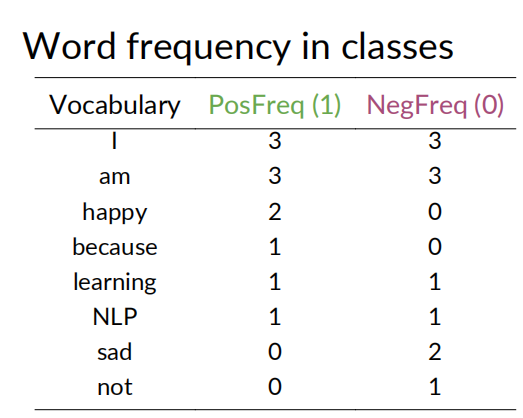

[参考视频](https://www.coursera.org/learn/classification-vector-spaces-in-nlp/)

## Week1 分类tweets

个人感觉这个方法比较粗糙，准确率不高

### 预处理

- Removing stopwords, punctuation, handles and URLs
- Stemming
- Lowercasing

### 正负数据计算

把收集来的tweets语料分成两类，positive和negative

为每个单词在postive和nagative中的的次数计数， 如：

### 特征提取
对于一个tweet，提取3个features
$$ [Bias, Sum Pos. Freq, Sum Neg. Freq] $$
$Bias=1$  
$Sum Pos. Freq = \sum_{\omega } freqs(w, 1)$  
$Sum Neg. Freq = \sum_{\omega } freqs(w, 0)$

如，freqs[("today",1.0)] 表示today在pos的tweets中出现的次数
freqs[("today",0.0)] 表示today在neg的tweets中出现的次数

每个单词在正负样本中出现的计数的总和

每个tweet，就对应下面一个三元组

$$ [1, \sum_{\omega } freqs(w, 1), \sum_{\omega } freqs(w, 0)] $$

### 训练

训练方法就是逻辑回归(Logistic Regression)

- input: 训练集中每个tweet的所有三元组
- output: 每个tweet的标签

## Week2 概率 + 贝叶斯规则

朴素贝叶斯是在指，**假设用于分类的所有特征都是互相独立没有关联的**。 虽然这个假设非常的强，实际中不太可能出现，单作为简单的处理方式，还是可以的。

在一个大的语料库中，对每个单词在正负两种情感的tweet中出现的次数进行统计,
得到 $P(w_i|pos)$ 和 $P(w_i|neg)$

现在的问题是，对于一个新的tweet，我们要分析它的正负情感属性。
这个新tweet中出现了这些单词，$w_1,w_2,...,w_m$。这相当于计算$P(pos|(w_1,w_2,...,w_m))$，或计算$P(neg|(w_1,w_2,...,w_m))$

根据贝叶斯公式，可知
$$ P(pos|(w_1,w_2,...,w_m))=\frac{P(pos)P((w_1,w_2,...,w_m)|pos)}{P(w_1,w_2,...,w_m)}  $$

**按朴素贝叶斯的假设** $P((w_1,w_2,...,w_m)|pos) = P(w_1|pos)...P(w_m|pos)=\prod_{i=1}^{m}P(w_i|pos)$

我们可以通过计算 $P(pos|(w_1,w_2,...,w_m))$ 和 $P(neg|(w_1,w_2,...,w_m))$ 的比值来对新 tweet进行评估，那么
$$\frac{P(pos|(w_1,w_2,...,w_m))}{P(neg|(w_1,w_2,...,w_m))}=\frac{P(pos)\prod_{i=1}^{m}P(w_i|pos)}{P(neg)\prod_{i=1}^{m}P(w_i|neg)}=\frac{P(pos)}{P(neg)}\prod_{i=1}^{m}\frac{P(w_i|pos)}{P(w_i|neg)}$$

如果P(pos)=P(neg)，可以约掉这两项，实际中可能它们并不相同，计算的时候就要带着这两项。

简化后，实际我们只需要计算这个的比值，将它与1进行比较
$$\prod_{i=1}^{m}\frac{P(w_i|pos)}{P(w_i|neg)}$$

由于某些词$P(w_i|pos)或P(w_i|neg)$可能为0，为了避免除以0，可以做一个Laplacian Smoothing

### Laplacian Smoothing
$$P(w_i|class)=\frac{freq(wi,class)+1}{N_{class}+V_{class}},  class\in \left \{  pos,neg\right \} $$

$N_{class}$=frequency of all words in class  
$V_{class}$= number of unique words in class

拉普拉斯变换之后，就不会有除以0的情况了

### log likelyhood
P(pos) 和 P(neg) 也称为先验概率。
以下是完整的朴素贝叶斯二分类公式
$$\frac{P(pos)}{P(neg)}\prod_{i=1}^{m}\frac{P(w_i|pos)}{P(w_i|neg)}$$

为了避免运算过程中的精度问题，将上面的公式改为log形式
$$log(\frac{P(pos)}{P(neg)}\prod_{i=1}^{m}\frac{P(w_i|pos)}{P(w_i|neg)})=log(\frac{P(pos)}{P(neg)})+log(\prod_{i=1}^{m}\frac{P(w_i|pos)}{P(w_i|neg)})=log(\frac{P(pos)}{P(neg)})+\sum_{i=1}^{m}log(\frac{P(w_i|pos)}{P(w_i|neg)} )$$

判断准则是，以上公式的值是否大于0，大于0为正属性，小于0为负属性

### 朴素贝叶斯的训练

- 收集标注语料库
- 预处理
  - owercase
  - Remove punctuation, urls, names
  - Remove stop words
  - Stemming
  - Tokenize sentence
- 计数，每个词统计在正负样本中的次数
- 计算 $P(w|class)$
- 计算 $\lambda(w)=log(\frac{P(w|pos)}{P(w|neg)})$
- 计算 $logprior=log(\frac{P(pos)}{P(neg)})$

### 应用场景
 - Sentiment analysis
 -  Author identification
 -  Information retrieval
 -  Word disambiguation
 -  Simple, fast and robust!

## Week3 词向量

