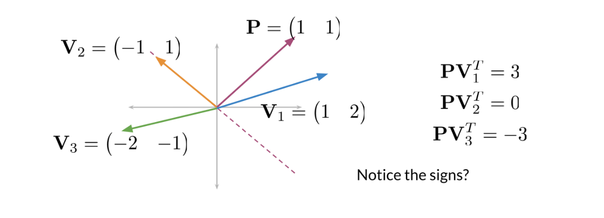

2025/4/20

[参考视频](https://www.coursera.org/learn/classification-vector-spaces-in-nlp/home/week/4)

## Locality sensitive hashing （位置敏感哈希）
Locality sensitive hashing is a technique that allows you to hash similar inputs into the same buckets with high probability. 

一些点，如何用一个平面将它们分开，使得不同的点被分隔在平面的两侧，相当于找到一个Hash函数，将这些点分类。

### 一个平面
对于二维平面的点，每个点看作从原点的一个向量，考虑如何找到一条过原点的直线（下图的虚线），如何将这些向量分在这条直线两侧，先找到它的一个法向量P

这里使用的是 **向量的内积**，数学上点乘，就是

$\vec{a} \cdot \vec{b} = |a||b|cos\theta$

具有性质
1. 表征或计算两个向量之间的夹角：同向是正，反向是负，垂直为0
2. b向量在a向量方向上的投影*|a|  ($\vec{a} \cdot \vec{b} = |a||b|cos\theta=|a|p,p为b在a上的投影$)

这样通过判断向量Vi与P的内积就可以直到Vi是在哪个分类中。

### 多个平面
如果要用多个平面将这些点分割在多个子区域内
可以根据V与P的内积值的正负号，决定V在这个平面的Hash值Hi
将所有Hi加和，计算总的Hash值
$$h = \sum_{i=1}^{n} 2^i *h_i   (其中 h_i=\begin{cases}
1 当 sign(\vec{a} \cdot \vec{b}) > 0\\
0 其他
\end{cases} )$$

