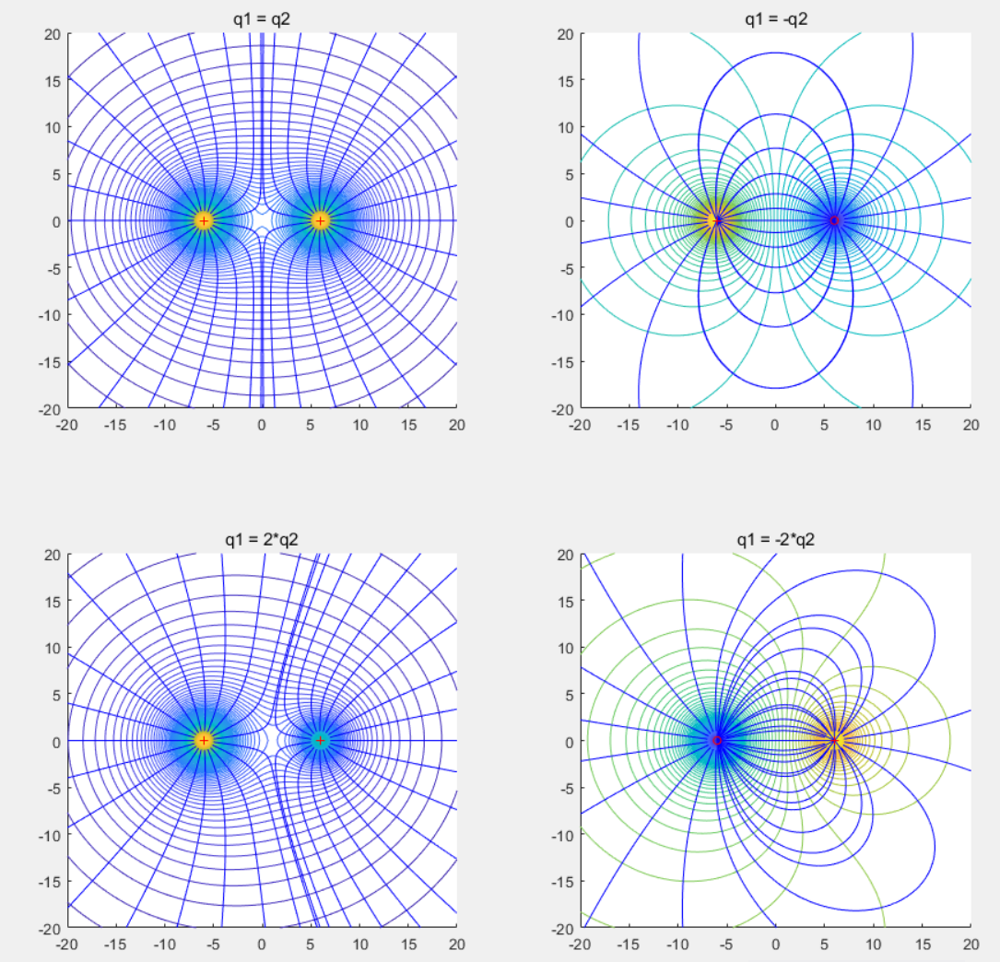

## 电荷
- 导体有自由电子，感应起电
- 绝缘体没有自由电子，也能通过极化现象带电

起电方式：
- 摩擦起电
- 感言起电
- 接触起电，两小球接触，各自电荷比=半径比，q1:q2 = r1: r2

## 电荷守恒定律

与外界没有电荷交换的系统，电荷的**代数和**保持不变

电量单位：库伦(C) $1C=1AS$ (1库伦表示1安培秒)

最小单位电荷电量: $e = 1.6 * 10^{-19} C$ 一个质子或一个电子所带电量，最初由密里根油滴实验测得。

核质比 = $\frac{q}{m}$     粒子电荷: 例子质量

## 库伦定律

在真空中，两个静止点电荷之间的相互作用力（静电力）与它们的电荷量的乘积成正比，与它们之间的距离的平方成反比。

**点电荷**：只有电量，没有体积，r<<d

库伦定律的数学表达式为：
$$F = k \frac{q_1 q_2}{r^2}$$

其中：
 - F 是作用在两个电荷上的力（单位：牛顿 N）\
 - k 是库伦常数，约为 $9.0 \times 10^9 N·m^2/C^2$ \
 - q1 和 q2 是两个点电荷的电量（单位：库仑 C）\
 - r 是两个电荷之间的距离（单位：米 m）

质子与电子之间的库仑力远大于万有引力之：$F_库/F_万\approx 2*10^{37}$ \
因此在微观层面，是可以不考虑粒子间的万有引力的。

**均匀带电**的球体或球壳，可以看成是在球心处的点电荷，均匀带电说明不是导体

介质中库伦定律的数学表达式为：
$F = \frac{k}{\epsilon _r} \frac{q_1 q_2}{r\^2}$

$\epsilon _r$ - 相对介电常数

## 电场
库仑力的作用方式是电场

电场的大小可以用电场强度（E）来描述，其定义式为：
$$E = \frac{F}{q}$$
其中E代表电场强度，F是电荷在电场中所受的力，q是置于电场中的检验电荷的电量。
电场的大小与试探电荷无关。

电场**方向**是描述正电荷在电场中受力方向的矢量，正场源电荷产生发散电场，负场源电荷产生吸收电场。

点电荷的场强公式：
$$E = k\frac{Q}{r^2}$$

均匀带电球壳
 - 球壳外部场强(r>R): $E = k\frac{Q}{r^2}$
 - 球壳内部(r<R): $E = 0$
 - 球壳上(r=R): $E = \frac{1}{2}k\frac{Q}{r^2}$  (可能要用到高等数学在证明)

均匀带电球体
 - 球壳外部场强(r>R): $E = k\frac{Q}{r^2}$
 - 球壳内部(r<R): $E = k\frac{Q_内}{r^2}=k\frac{Q}{R^3}r$

## 电场线
电场线是用来形象地描述电场的分布情况的一种曲线
- 电场线的方向表示电场的方向，且在每一点的切线方向与该点的电场强度方向一致
- 电场线从正电荷或无限远出发，终止于负电荷或无限远，是不闭合的曲线（静电场）
- 电场线的疏密程度表示电场的强弱，离点电荷越近，电场线越密，场强越大
- 电场线不会相交，因为在电场中任意一点的电场强度不可能有两个方向

用电场线的疏密描述电场强度，得：
$$ E=k\frac{Q}{r^2}=\frac{N}{4\pi r^2} $$
$$ N=4\pi kQ - N用于约定电场线的数量$$ 

双点电荷的电场线举例：

## 静电平衡
导体进入静电场
- 电荷移动，形成感应电场
- 感应电场与外电场反向
- 内外场抵消，静电平衡

静电平衡时：
- 电荷不在定向移动
- 导体内部场强处处为零
- 表面电场线与表面处处垂直
- 导体上的电荷分布在导体外部，内部无净电荷
- 尖锐处电荷密集，平坦凹陷处电荷稀疏

静电屏蔽
- 导体壳可以屏蔽外电场
- 不接地导体壳不能屏蔽内电场
- 接地导体壳可以屏蔽内电场

## 电势能
- 静电力做功与路径无关（保守力）
- 电荷在电场中具有电势能
- 电场力做功等于电势能减少

## 电势
电场中某个点的电势：试探电荷的电势能与电量的比值
$\phi = \frac{E_p}{q}$
- $\phi$, $E_q$, $q$ 都是标量， 有正负
- 电势的单位是伏特
- 正电荷在高势能处势能大
- 负电荷在低势能处势能大
- 顺电场线，电势下降；逆电场线，电势上升；垂直电场线，电势不变
- 电场线方向，地势下降最快
- 点电荷的电势公式$\phi=k\frac{Q}{r}$
- 电场是矢量，电势是标量